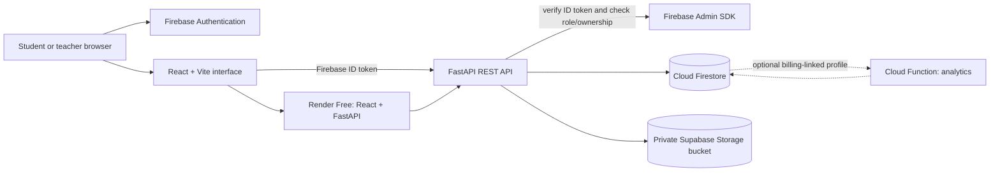

# Cloud-Based Student Assignment Submission & Feedback Portal

An Option B implementation using React + Vite, Firebase Authentication, Cloud Firestore, private object storage, and a Python FastAPI REST API. The browser signs users in with Firebase Authentication; FastAPI verifies every Firebase ID token and applies role and ownership checks. The no-billing cloud profile uses Render Free for the combined app/API and Supabase Storage for private files. Local emulator development stores uploads under `backend/local_uploads/`.

> **No-billing deployment profile:** Render Free hosts the React/FastAPI app, Firebase Spark provides Authentication and Firestore within its quotas, and a private Supabase Storage bucket stores uploaded files. This avoids linking a payment method. Supabase free projects can pause after inactivity and Render free web services sleep while idle. Optional Firebase Cloud Storage/Cloud Run deployment requires a billing-linked Google project; check [Firebase pricing](https://firebase.google.com/pricing) and [Cloud Storage billing requirements](https://firebase.google.com/docs/storage/faqs-storage-changes-announced-sept-2024) before choosing that profile.

## Overview

Teachers create courses and assignments, set UTC deadlines and file policies, review course submissions, download files, and return marks and feedback. Students register/sign in, view assignments, upload or resubmit permitted files, check submission status, download their own work, and read feedback. The Firebase Function for submission analytics is included for the optional billing-linked Firebase deployment profile.

## Problem Statement

Assignment distribution, file collection, deadline tracking, grading, and feedback can become fragmented across email, messaging, and separate file-sharing tools. This portal brings those tasks into one role-based application and keeps submission metadata and uploaded files in managed cloud services.

## Objectives

- Provide one place for teachers to publish assignments and students to submit work.
- Authenticate users and enforce student/teacher permissions on the server.
- Validate deadlines, allowed file types, file sizes, and resubmission rules.
- Store assignment records in Firestore and uploaded files in private object storage.
- Let teachers grade submissions and return feedback that students can review.
- Demonstrate local emulator development and a no-billing cloud deployment profile.

## Features

- Email/password registration and sign-in, with student registration by default.
- Teacher-managed courses and assignments with UTC deadlines and upload policies.
- Private file submission, permitted resubmission, version tracking, and late status.
- Teacher review, download, grading, and feedback; students can view their own results.
- Firebase Auth/Firestore emulators for local development and a Render-hosted cloud profile.

## Development History

As a student, I developed and ran the project locally through the phases below before publishing it to GitHub. The repository was uploaded afterward in one initial commit. These phases describe the implementation sequence; they are not separate Git commits or claims about exact calendar days.

| Phase | Main files or areas | Functionality implemented |
|---|---|---|
| 1. Architecture and repository | `frontend/`, `backend/`, `cloud/`, `render.yaml`, `.github/workflows/tests.yml` | Established the React, FastAPI, Firebase, and cloud deployment structure. |
| 2. Authentication | `frontend/src/services/firebase.js`, `frontend/src/pages/App.jsx`, `backend/app/services/firebase.py`, `backend/app/services/auth.py`, `backend/app/routes/profile.py` | Added Firebase email/password sign-in, ID-token verification, and user profile setup. |
| 3. Role-based access | `backend/app/services/auth.py`, `backend/app/scripts/promote_teacher.py`, `cloud/firestore/firestore.rules`, protected API routes | Kept new users in the student role and added server-side teacher/ownership checks. Teacher promotion is an administrator action. |
| 4. Assignment management | `backend/app/routes/courses.py`, `backend/app/routes/assignments.py`, `backend/app/models/schemas.py`, `frontend/src/pages/App.jsx` | Added teacher course and assignment creation and management. |
| 5. Cloud database | `backend/app/services/firebase.py`, `cloud/firestore/firestore.rules`, `cloud/firestore/firestore.indexes.json` | Connected backend data operations to Firestore and defined rules and indexes. |
| 6. Cloud object storage | `backend/app/services/object_storage.py`, `cloud/storage/storage.rules`, `backend/.env.example` | Added local file storage for emulator use and private Supabase Storage for the no-billing hosted profile. |
| 7. Student submissions | `backend/app/routes/submissions.py`, `frontend/src/services/api.js`, `frontend/src/pages/App.jsx` | Added file submission, server-side validation, private storage, and submission metadata. |
| 8. Deadline and resubmission logic | `backend/app/routes/assignments.py`, `backend/app/routes/submissions.py`, `backend/app/models/schemas.py`, `backend/tests/test_api.py` | Added UTC deadline checks, late status, file policies, resubmission rules, and version tracking. |
| 9. Teacher feedback and grading | `backend/app/routes/submissions.py`, `frontend/src/pages/App.jsx` | Added teacher review, private download, marks, and feedback that students can view. |
| 10. Student and teacher dashboards | `frontend/src/pages/App.jsx`, `frontend/src/style.css` | Added role-specific views for assignments, submissions, grading, and feedback. |
| 11. Testing and security | `backend/tests/test_api.py`, `cloud/firestore/firestore.rules`, `cloud/storage/storage.rules`, `.github/workflows/tests.yml` | Added API authorization tests, restrictive direct-access rules, and an automated CI workflow. The test checklist is documented separately; this phase entry does not claim every check passed. |
| 12. Cloud deployment | `render.yaml`, `backend/Dockerfile`, environment examples, Firebase and Supabase project configuration | Deployed the React/FastAPI service to Render Free and connected Firebase Spark and private Supabase Storage. The Render service reached Live; hosted end-to-end workflow verification remains a separate check. |
| 13. README and documentation | `README.md`, `docs/PROJECT_REPORT.md` | Documented architecture, setup, APIs, deployment, security, limitations, and learning outcomes. |

## User Roles

- **Student:** views assignments, submits or resubmits permitted files, and views their own submission status, grades, and feedback.
- **Teacher:** creates courses and assignments, reviews submissions for their courses, downloads files, and grades work.
- **Project administrator:** promotes a trusted account to teacher by changing its Firestore profile role. Public registration cannot grant teacher privileges.

## Cloud Computing Concepts

- **Managed identity:** Firebase Authentication handles account credentials and issues ID tokens.
- **Managed NoSQL database:** Cloud Firestore stores profiles and application records.
- **Object storage:** a private Supabase Storage bucket stores uploaded file bytes separately from Firestore metadata.
- **Platform as a Service (PaaS):** Render builds and hosts the combined React/FastAPI service.
- **API-based architecture:** the browser sends Firebase ID tokens to FastAPI, which verifies identity and checks resource permissions before accessing cloud services.
- **Local emulation:** Firebase emulators and local file storage support development without using the hosted services.

## Assignment Workflow

An authenticated teacher creates a course, then publishes an assignment with a description, UTC due date, maximum marks, allowed file types, size limit, and resubmission policy. Teachers can update or remove assignments they own, subject to the documented submission constraints.

## Submission Workflow

An authenticated student selects an assignment and uploads a permitted file. The API checks the student's identity, file policy, deadline, and resubmission rules; stores the file in private object storage; and records the storage key and submission metadata in Firestore. The API tracks versions and whether the submission was late.

## Feedback & Grading

The teacher who owns the course reviews a submission, downloads its private file through the API, and records marks and feedback. The student can later view the grade and feedback for their own submission. The API rejects marks above the assignment's maximum.

## Folder Structure

```text
.
├── .firebaserc.example
├── .github/workflows/tests.yml
├── firebase.json
├── render.yaml                       # No-billing Render deployment blueprint
├── frontend/
│   ├── .env.example
│   ├── index.html
│   ├── package.json
│   ├── package-lock.json
│   └── src/
│       ├── components/.gitkeep       # Reserved; reusable UI is currently in pages/App.jsx
│       ├── pages/App.jsx              # Auth flow and role dashboards
│       ├── services/api.js            # Bearer-token API client
│       ├── services/firebase.js       # Firebase Auth client/config
│       ├── utils/.gitkeep              # Reserved for shared frontend helpers
│       ├── main.jsx
│       └── style.css
├── backend/
│   ├── .env.example
│   ├── Dockerfile
│   ├── requirements.txt
│   ├── app/
│   │   ├── main.py                    # FastAPI app and route registration
│   │   ├── config.py
│   │   ├── middleware/request_id.py
│   │   ├── models/schemas.py
│   │   ├── routes/                    # Profile, courses, assignments, submissions
│   │   ├── scripts/promote_teacher.py
│   │   ├── services/                  # Firebase Admin, local/cloud storage, token verification, RBAC
│   │   └── utils/                     # Reserved shared backend helpers
│   └── tests/test_api.py
├── cloud/
│   ├── firestore/
│   │   ├── firestore.rules            # Denies direct client data access
│   │   └── firestore.indexes.json
│   ├── functions/
│   │   ├── index.js                   # Submission trigger and analytics job
│   │   ├── package.json
│   │   └── package-lock.json
│   └── storage/storage.rules          # Denies direct client file access
├── docs/PROJECT_REPORT.md
├── legacy-flask/                      # Archived Flask/SQLite prototype
├── reports/.gitkeep                   # Put final report exports here
├── sample_files/.gitkeep              # Add dummy assignment files here
└── screenshots/.gitkeep               # Add demo screenshots here
```

`.env`, `.env.local`, service-account JSON keys, virtual environments, `node_modules/`, build output, test caches, and local `instance/` data are ignored local files. They may appear in VS Code after setup but are intentionally absent from this repository tree. Never commit service-account keys.

## Architecture



Firestore stores user profiles, courses, assignments, submissions, and analytics metadata. The private Supabase Storage bucket contains deployed uploaded bytes; local emulators use the local upload folder. The object's key is recorded in Firestore; users never receive a permanent public file URL. FastAPI checks the student's ownership or teacher's course ownership before downloading. The trusted backend uses a Firebase Admin service identity and a server-only Supabase service-role key, so backend validation is mandatory.

## Technology Stack

- **Frontend:** React 19, Vite, Firebase Web SDK.
- **Authentication:** Firebase Authentication email/password. Registration is student-only. Promote teacher accounts with the admin script.
- **Database:** Cloud Firestore.
- **File storage:** Supabase Storage private bucket for no-billing deployment; local folder for emulator runs.
- **REST API:** Python FastAPI, Firebase Admin SDK, Firebase ID-token verification.
- **Serverless:** Firebase Functions source processes submission events and rebuilds analytics; deploying those functions requires a billing-linked Firebase project and is outside the no-billing profile.
- **Hosting:** Render Free serves the built React app and FastAPI API from one service. Free web services sleep while idle; files remain in Supabase Storage.

## Database Design

- `users/{uid}`: `name`, `email`, `role`, timestamps.
- `courses/{courseId}`: `name`, `description`, `teacherId`, `createdAt`.
- `assignments/{assignmentId}`: `courseId`, `title`, `description`, UTC `dueAt`, `maxMarks`, `allowedTypes`, `maxFileSizeMB`, `allowResubmission`, `createdBy`, `createdAt`.
- `submissions/{submissionId}`: `assignmentId`, `courseId`, `studentUid`, `studentName`, `fileName`, private `storagePath`, `size`, `mime`, UTC `submittedAt`, `version`, `late`, `status`, optional marks/feedback/grading timestamp.
- `submissionCounters/{counterId}`: transactionally incremented version counter for one student and assignment.
- `analytics/{courseId_assignmentId}`: total submissions, late count, on-time percentage, update time.
- `processedEvents/{eventId}`: trigger idempotency record.

Primary relationships are represented by IDs. Firestore is document-oriented rather than relational; API queries and indexes support access patterns. Large file contents stay in object storage because that service is optimized for durable blobs and transfer.

## Cloud Storage

For the no-billing deployment profile, uploaded file bytes are stored in a **private Supabase Storage bucket** named `assignment-submissions`. Firestore stores each file's private storage path and metadata, not the file contents. The backend uses a server-only storage credential and checks the caller's role and ownership before allowing downloads. Local emulator runs use `backend/local_uploads/` instead. This deployment profile does not use Firebase Cloud Storage.

## Installation and Local Setup on Windows

### 1. Install prerequisites

Install Node.js 22 (20 is also currently supported by Firebase Functions), Python 3.11+, Git, and Java JDK 21 or newer. Firestore Emulator needs Java; current emulator releases require Java 21+. Install Firebase CLI:

```powershell
npm.cmd install -g firebase-tools
firebase.cmd --version
```

The earlier `.venv` in this workspace belonged to the Flask version; create a fresh environment for the FastAPI backend.

### 2. Prepare no-billing local emulators

The first run below uses Firebase Auth, Firestore, and Functions emulators with a local folder for uploaded files. It does not need a Firebase Console project, service-account key, or billing account. For no-billing cloud deployment, use the Render + Firebase Spark + private Supabase Storage profile below. Firebase Cloud Storage, Cloud Functions, and Cloud Run deployment are optional and require a billing-linked Google project.

### 3. Install packages

From the project root in PowerShell:

```powershell
cd frontend
npm.cmd install
Copy-Item .env.example .env.local
cd ..\backend
py -3.11 -m venv .venv
.\.venv\Scripts\Activate.ps1
python -m pip install -r requirements.txt
Copy-Item .env.example .env
cd ..\cloud\functions
npm.cmd ci
cd ..\..
```

Edit `frontend/.env.local` and set these local demo values:

```dotenv
VITE_FIREBASE_API_KEY=demo-api-key
VITE_FIREBASE_AUTH_DOMAIN=demo-assignment-portal.firebaseapp.com
VITE_FIREBASE_PROJECT_ID=demo-assignment-portal
VITE_FIREBASE_STORAGE_BUCKET=demo-assignment-portal.appspot.com
VITE_FIREBASE_MESSAGING_SENDER_ID=123456789000
VITE_FIREBASE_APP_ID=1:123456789000:web:localdemo
VITE_API_BASE_URL=http://127.0.0.1:8000
VITE_USE_FIREBASE_EMULATORS=true
```

Edit `backend/.env` with these values:

```dotenv
FIREBASE_PROJECT_ID=demo-assignment-portal
FIREBASE_STORAGE_BUCKET=demo-assignment-portal.appspot.com
GOOGLE_APPLICATION_CREDENTIALS=
ALLOWED_ORIGINS=http://localhost:5173,http://127.0.0.1:5173,http://localhost:5174,http://127.0.0.1:5174
MAX_UPLOAD_BYTES=16777216
ALLOW_LATE_SUBMISSIONS=true
ALLOW_RESUBMISSIONS=true
LOCAL_STORAGE_DIR=local_uploads
FIREBASE_AUTH_EMULATOR_HOST=127.0.0.1:9099
FIRESTORE_EMULATOR_HOST=127.0.0.1:8080
```

The `demo-` project ID tells Firebase CLI to use an emulator-only project. Keep the exact same ID in both files. `local_uploads` is created below `backend/` when the first file is submitted. To activate the Python environment in a new terminal, use `cd backend` followed by `.\.venv\Scripts\Activate.ps1`.

### 4. Start the emulators and app

Terminal 1, from the project root. First startup downloads emulator binaries:

```powershell
firebase.cmd emulators:start --project demo-assignment-portal --only auth,firestore,functions,pubsub
```

You should see Auth on port `9099`, Firestore on `8080`, Functions on `5001`, and the Emulator UI on `4000`. 

Terminal 2, from `backend/`:

```powershell
.\.venv\Scripts\python.exe -m uvicorn app.main:app --reload --port 8000
```

Terminal 3, from `frontend/`:

```powershell
npm.cmd run dev
```

Open `http://localhost:5173`. Register an account to use as the demo teacher. Sign out, then in Terminal 4 run from `backend/`:

```powershell
.\.venv\Scripts\python.exe -m app.scripts.promote_teacher teacher@example.edu
```

Sign out and back in so the API reads the updated role. The script talks to the Auth and Firestore emulators because the emulator variables are in `backend/.env`. The emulator UI at `http://127.0.0.1:4000` lets you inspect test users and Firestore documents. Uploaded files are stored in `backend/local_uploads/`.

As the teacher, create a course and assignment. Then open a second browser/private window, register a student, and submit a PDF. Return to the teacher window to download and grade the work. Student feedback appears on the student dashboard. The API docs are at `http://127.0.0.1:8000/docs` and its health check is `http://127.0.0.1:8000/health`.

### 5. Optional Firebase Cloud Storage setup (billing linked)

The no-billing cloud deployment below does not use Firebase Storage. If you intentionally use Firebase Cloud Storage instead, create a Firebase project, enable Email/Password Authentication, Firestore, and Storage, then configure a web app and backend identity. Cloud Storage requires a linked Blaze billing account as of February 3, 2026; no-cost quotas may apply, but usage over quotas can be billed. Do not use this optional profile if you do not want to link billing.

### 6. Demonstrate the workflow

Sign in as teacher, create a course, then publish an assignment with a future deadline. Sign in as a student in a second browser/private window, register, and upload a PDF. Return to the teacher account, download and grade the file, then sign back into the student account and verify the grade and feedback. The student can download only their own file. Test late status by creating an assignment with a past UTC deadline while late submissions are enabled.

## Environment Variables

Local configuration is supplied through `frontend/.env.local` and `backend/.env`, created from the checked-in `.env.example` files. These files contain environment-specific values and secrets and are ignored by Git. For deployment, `render.yaml` declares the required variable names; enter the Firebase web configuration, Firebase project ID and service-account JSON, and Supabase URL and server key in the Render dashboard. Never commit the Firebase service-account JSON or Supabase server key. The browser-facing `VITE_FIREBASE_*` values configure Firebase Authentication; the backend-only credentials must remain server-side.

## REST APIs

All `/api` routes except `/health` require `Authorization: Bearer <Firebase ID token>`.

| Method | Endpoint | Access |
|---|---|---|
| `GET`, `PUT` | `/api/profile` | Signed-in user; profile update cannot change role |
| `GET`, `POST` | `/api/courses` | Signed in; teacher creates a course |
| `GET`, `POST` | `/api/assignments` | Signed in; teacher creates within own course |
| `GET`, `PUT`, `DELETE` | `/api/assignments/{id}` | Owner teacher; delete is blocked if submissions exist |
| `POST` | `/api/assignments/{id}/submit` | Student multipart upload |
| `GET` | `/api/submissions/me` | Student's own submissions |
| `GET` | `/api/teacher/submissions` | Teacher's courses |
| `GET` | `/api/assignments/{id}/submissions` | Owning teacher |
| `GET` | `/api/submissions/{id}` | Owning student or course teacher |
| `GET` | `/api/submissions/{id}/feedback` | Owning student |
| `POST` | `/api/submissions/{id}/grade` | Course teacher; marks limited to maximum |
| `GET` | `/api/submissions/{id}/download` | Owning student or course teacher |

Expected errors include 401 missing/expired token, 403 role denial, 404 unavailable resource, 409 disallowed operation/deadline, 413 too large, and 415 invalid extension. FastAPI request schema errors return 422.

## Authentication & Authorization

Firebase Authentication manages email/password accounts and supplies an ID token to the frontend. The frontend sends that token as a bearer token to FastAPI. The API verifies the token with Firebase Admin SDK, loads the user's role from the protected `users/{uid}` Firestore document, and enforces role, course ownership, and submission ownership on protected routes. New registrations receive the student role; teacher promotion is an administrative action.

## Security

Firebase Auth handles passwords; the backend verifies ID tokens and obtains roles from protected Firestore profile documents. Server-side checks enforce course ownership and private file access. Upload validation checks configured extension and size limits and uses random object identifiers; production should add MIME signature checks and malware scanning. Never treat a browser-supplied UID, role, timestamp, deadline status, or filename as authorization truth. Use HTTPS, private bucket policies, secret management, retention policies, and operational audit logs before production. Firebase Admin credentials and the Supabase service-role key belong only in Render environment variables, never source control.

The upload sequence stores the object, then creates metadata inside a Firestore transaction that increments the version counter; if metadata creation fails, the object is deleted. Retriable clients should avoid blind duplicate submits; production can add explicit idempotency keys. The Cloud Function uses the event ID to avoid double-counting when a trigger retries, and the scheduled job rebuilds analytics.

## Failure Handling

The API returns explicit HTTP errors for missing/expired credentials, permission denials, unavailable resources, invalid upload types, oversized files, and disallowed deadline or resubmission operations. If writing submission metadata fails after an object upload, the uploaded object is deleted to avoid an orphaned file. Cloud Function event processing records event IDs to reduce duplicate analytics updates when events retry. These safeguards do not replace production monitoring, backups, or a full recovery plan.

## Scalability

The frontend is built as static assets and served alongside a stateless FastAPI service; Firestore and object storage are managed cloud services that can scale independently of the app process. A larger deployment could use multiple API instances, a CDN for the frontend, background queues for scanning or notifications, tuned Firestore indexes, and monitoring. This free student-demo deployment has not been load-tested; Render's free service sleeps while idle and has resource limits.

## Cloud deployment without a billing account

This free profile deploys one combined React/FastAPI service on Render Free, keeps Firebase Authentication and Firestore on the Spark plan, and stores files in a private Supabase Storage bucket. Firebase Functions source remains in `cloud/functions/`, but Firebase Functions are not deployed in this profile.

1. Create a Firebase project on the no-cost Spark plan. Enable Email/Password Authentication and create a Firestore database. Register a Web app and copy its Firebase config values. Create a Firebase Admin service-account JSON key for the backend; keep it out of Git.
2. Create a Supabase Free project and a **private** Storage bucket named `assignment-submissions`. Copy the project URL and service-role key. The key is secret and must only go into Render's backend environment.
3. Push the project to a GitHub repository. In Render, choose **New → Blueprint**, connect that repository, and let Render read the root `render.yaml` file.
4. Enter the Firebase web config values (`VITE_FIREBASE_*`) requested by the blueprint. Enter `FIREBASE_PROJECT_ID`, the complete `FIREBASE_SERVICE_ACCOUNT_JSON`, `SUPABASE_URL`, and `SUPABASE_SERVICE_ROLE_KEY` as backend deployment variables. Do not put service-account JSON or the Supabase service-role key in source files.
5. After deployment, add the Render `onrender.com` hostname to Firebase Authentication's authorized domains. Open the Render URL and `/health`; create new demo accounts because emulator users are local and do not transfer.
6. Promote the cloud demo teacher in Firebase Console: copy the teacher's UID from Authentication, open Firestore `users/{uid}`, and change only `role` from `student` to `teacher`. Sign out and back in.

The free profile avoids a payment method. Render Free services sleep after 15 minutes without requests, and the first request after sleep may take about a minute. Render's free filesystem is temporary, so files use Supabase Storage instead. Supabase Free includes 1 GB file storage and may pause projects after seven days of low activity. Review [Render Free limits](https://render.com/docs/free), [Supabase pricing](https://supabase.com/pricing), and [Supabase project pausing](https://supabase.com/docs/guides/platform/free-project-pausing). This is a student demo profile, not a production availability guarantee.

The alternative Firebase Hosting + Cloud Run + Firebase Cloud Storage deployment is intentionally not used here because those services require linking a billing account. Do not select a paid plan for this no-billing setup.

## Testing and Proof

This section is a **verification checklist**, not a claim that every listed check has passed. Run backend tests from `backend/` with `pytest -q` and build the frontend with `npm run build` from `frontend/`. The GitHub Actions workflow is configured to run these checks. Manually verify registration/sign-in, teacher promotion, role rejection, course/assignment creation, valid/invalid/oversized uploads, on-time and late status, versioned resubmission, cross-student download denial, teacher grading, student feedback, Firebase rules, API docs, emulator behavior, and hosted behavior. Record actual test outcomes separately before presenting them as completed results.

## Local folder map for the original setup guide

| Guide file/snippet | Destination in this repository |
|---|---|
| React/Firebase initialization | `frontend/src/services/firebase.js` (already implemented; fill `frontend/.env.local`) |
| Upload + Firestore metadata | Replaced by React form in `frontend/src/pages/App.jsx` calling protected FastAPI upload route in `backend/app/routes/submissions.py` |
| Firestore rules | `cloud/firestore/firestore.rules` (intentionally stricter because API uses Admin SDK) |
| Storage rules | `cloud/storage/storage.rules` |
| Cloud Function | `cloud/functions/index.js` |
| Similarity/auto-grade AI | Optional future service; not part of Option B MVP |
| Firebase Hosting config | Root `firebase.json` |
| Backend tests | `backend/tests/`; frontend build checked by GitHub Actions |
| Feedback form | Teacher grading UI in `frontend/src/pages/App.jsx`, persisted by the grade API route |

The guide’s AI model and Cloud Run ML API are optional Step 4 extensions. They are intentionally not mixed into the assignment API.

## Results

The Render Blueprint created the `cloud-assignment-portal` web service on the Free plan, and the service reached **Live** status. The hosted sign-in page loaded at [https://cloud-assignment-portal-bpr4.onrender.com](https://cloud-assignment-portal-bpr4.onrender.com). Cloud account creation and the complete student-to-teacher workflow still need to be verified against the hosted Firebase and Supabase services; local emulator accounts do not transfer to the cloud project.

## Limitations

This is an educational project, not a production LMS. It has no course enrollment workflow, password reset screen, antivirus scanner, audit log viewer, rubric editor, notifications, pagination, or production monitoring dashboards. For real deployments, add those controls, test rules and IAM in a staging project, run load and security reviews, and establish backup/restore procedures.

## Future Improvements

Potential extensions include course enrollment, password reset, malware scanning, audit-log viewing, configurable rubrics, notifications, pagination, production monitoring, explicit idempotency keys, load/security testing, and documented backup/restore procedures. Firebase Functions analytics is available only in the optional billing-linked deployment profile.

## Learning Outcomes

- Integrating a React/Vite frontend with a FastAPI REST backend.
- Using Firebase Authentication tokens and server-side role/ownership checks.
- Designing Firestore documents and access patterns for a multi-role workflow.
- Separating submission metadata from private object storage.
- Handling file validation, deadlines, resubmission versions, and grading workflows.
- Using Firebase emulators for local work and deploying a service through a Render Blueprint.

## Author

Shraddha Verma, B.Tech, Feroze Gandhi Institute of Engineering And Technology, 29 Sept 2026. Use dummy users and files for demos.
